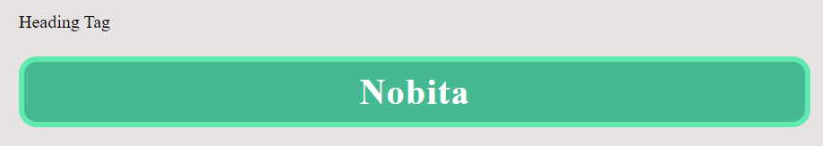
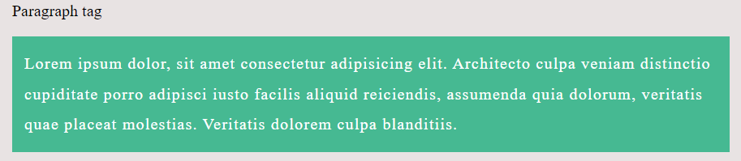
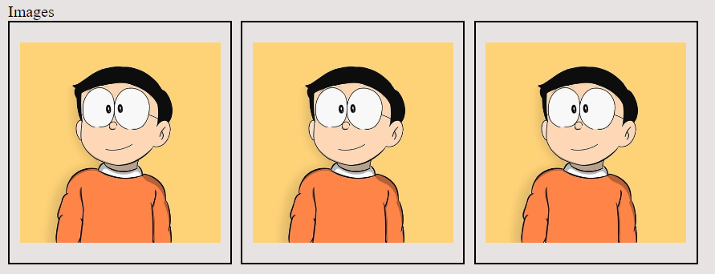
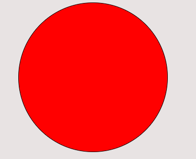

## CSS Styling: Inline and Internal

### Inline Styling

Inline styling allows you to apply CSS directly to individual HTML elements using the `style` attribute. Here's an example:

```html
<p style="color: blue; font-size: 18px;">
  This is a paragraph with inline styling.
</p>
```

In the above example, the `style` attribute is used to specify the CSS properties (`color` and `font-size`) and their corresponding values.

### Internal Styling

Internal styling involves placing CSS rules within the `<style>` tags inside the `<head>` section of an HTML document. Here's an example:

```html
<head>
  <style>
    p {
      color: blue;
      font-size: 18px;
    }
  </style>
</head>
<body>
  <p>This is a paragraph with internal styling.</p>
</body>
```

In the above example, the CSS rules for the `p` element are defined within the `<style>` tags.

### Common CSS Properties

- **Border**: Defines the border properties of an element. You can specify the width, style, and color of the border. Example:

  ```css
  border: 1px solid #000;
  ```

- **Margin**: Sets the margin space around an element. You can define values for top, right, bottom, and left margins. Example:

  ```css
  margin: 10px;
  ```

- **Padding**: Sets the padding space inside an element. You can define values for top, right, bottom, and left padding. Example:

  ```css
  padding: 10px;
  ```

- **Font Size**: Specifies the size of the font. Example:

  ```css
  font-size: 16px;
  ```

- **Text Align**: Sets the horizontal alignment of the text within an element. Example:

  ```css
  text-align: center;
  ```

- **Text Decoration**: Controls the appearance of text decorations such as underlines or line-through. Example:

  ```css
  text-decoration: underline;
  ```

- **Font Weight**: Specifies the thickness or boldness of the font. Example:

  ```css
  font-weight: bold;
  ```

- **Font Family**: Defines the font family to be used for an element. Example:

  ```css
  font-family: Arial, sans-serif;
  ```

- **Font Style**: Specifies the style of the font (e.g., normal, italic). Example:

  ```css
  font-style: italic;
  ```

- **Color**: Sets the color of the text. Example:

  ```css
  color: #ff0000;
  ```

- **Background Color**: Defines the background color of an element. Example:

  ```css
  background-color: #f0f0f0;
  ```

These are just a few commonly used CSS properties. Feel free to explore and experiment with more properties to enhance the styling of your web pages.

---

[Click here](Classwork/index.html) to view the full code. Feel free to copy and paste in your code editor and play around with properties by changing it's values.

## 1. Heading

```html
<style>
  /* only applies to h1, existing + this one */
  h1 {
    /* border: size type color */
    border: 5px solid rgb(98, 233, 175);
    border-radius: 16px;
    color: #fff;
    text-align: center;
  }
</style>
<!-- Heading -->
<span>Heading Tag</span>
<h1>Nobita</h1>
```



## 2. Paragraph

```html
<style>
  p {
    background-color: rgb(70, 185, 146);
    color: #fff;
    padding: 12px;
    letter-spacing: 1px;
    line-height: 30px;
  }
</style>
<!-- Paragraph -->
<span>Paragraph tag</span>
<p>
  Lorem ipsum dolor, sit amet consectetur adipisicing elit. Architecto culpa
  veniam distinctio cupiditate porro adipisci iusto facilis aliquid reiciendis,
  assumenda quia dolorum, veritatis quae placeat molestias. Veritatis dolorem
  culpa blanditiis.
</p>
```



## 3. Images

```html
<style>
  img {
    border: 2px solid;
    /* border: 2px dotted ; */
    /* border: 2px dashed ; */
    /* border: 2px double red; */
    /* padding: top right bottom left */
    padding: 20px 10px;
    /* padding-top/right/bottom/left */
    /* padding-top: 20px;
       padding-right: 10px;
       padding-left: 10px;
       padding-bottom: 20px; */
    margin: 0px 5px 10px 0;
    /* box-shadow: 0px 0px 14px rgba(0, 0, 0, 1); */
    transition: 0.2s all ease-in-out;
  }

  img:hover {
    box-shadow: 0px 0px 14px rgba(0, 0, 0, 1);
  }
</style>
<!-- Images -->
<span>Images</span>
<br />


<br />
```



## 4. Links

```html
<style>
  a {
    background-color: rgb(110, 230, 35);
    border-radius: 12px;
    color: #fff;
    font-weight: bold;
    margin: 20px 10px;
    padding: 10px 18px;
    text-decoration: none;
    transition: 0.3s all ease-in-out;
  }

  a:hover {
    background-color: rgb(94, 184, 38);
  }
</style>
<!-- Anchor tag -->
<a href="#">Link 1</a>
<a href="#">Link 2</a>
<a href="#">Link 2</a>
<a href="#">Link 2</a>
<br />
```


## 5. Classes

```html
<style>
  .myDiv {
    background-color: red;
    border-radius: 50%;
    height: 200px;
    margin: 20px;
    width: 200px;
  }
</style>
<!-- Creating a circle using div -->
<div class="myDiv"></div>
<br />
```

