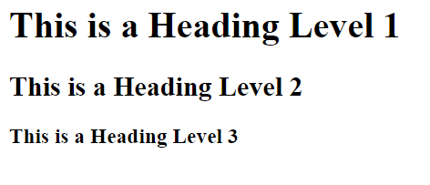
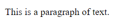
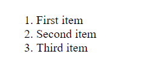
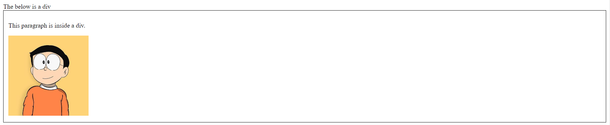

## HTML Basics

### Headings
Headings are used to define the structure of a web page. HTML provides six levels of headings, ranging from `<h1>` (the highest level) to `<h6>` (the lowest level). The size and visual appearance of the headings decrease from `<h1>` to `<h6>`. Here's an example:

```html
<h1>This is a Heading Level 1</h1>
<h2>This is a Heading Level 2</h2>
<h3>This is a Heading Level 3</h3>
```


### Paragraphs
Paragraphs are used to represent blocks of text. You can enclose text within a `<p>` tag to create a paragraph. Here's an example:

```html
<p>This is a paragraph of text.</p>
```


### Lists
Lists are used to present information in an ordered or unordered format. HTML provides two types of lists: ordered lists (`<ol>`) and unordered lists (`<ul>`). Here's an example of each:

Ordered List:
```html
<ol>
  <li>First item</li>
  <li>Second item</li>
  <li>Third item</li>
</ol>
```


Unordered List:
```html
<ul>
  <li>Red</li>
  <li>Green</li>
  <li>Blue</li>
</ul>
```


### Images
Images can be included in a web page using the `` tag. The `src` attribute specifies the URL or file path of the image, and the `alt` attribute provides alternative text for screen readers or when the image cannot be displayed. Here's an example:

```html

```


### Anchors (Links)
Anchors, or links, are used to navigate between web pages. You can create a link using the `<a>` tag. The `href` attribute specifies the URL of the destination page. Here's an example:

```html
<a href="https://www.example.com">Click here to visit Example.com</a>
```


### Divisions (Divs)
Divisions are container elements that are used to group and style other HTML elements. They are commonly used for layout purposes. Here's an example:

```html
<div>
  <p>This paragraph is inside a div.</p>
  
</div>
```


### Audio
The `<audio>` tag is used to embed audio content on a web page. The `src` attribute specifies the URL or file path of the audio file, and the `<source>` element allows you to specify multiple audio sources in different formats to ensure compatibility across different browsers. Here's an example:

```html
<audio controls>
  <source src="path/to/audio.mp3" type="audio/mpeg">
  <source src="path/to/audio.ogg" type="audio/ogg">
  Your browser does not support the audio element.
</audio>
```


### Video
The `<video>` tag is used to embed video content on a web page. Similar to the `<audio>` tag, you can specify multiple video sources using the `<source>` element. Here's an example:

```html
<video controls>
  <source src="path/to/video.mp4" type="video

/mp4">
  <source src="path/to/video.webm" type="video/webm">
  Your browser does not support the video element.
</video>
```


---